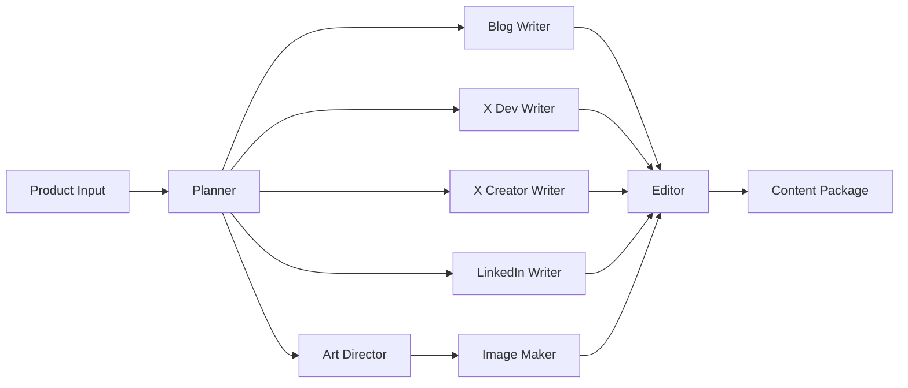

# Multi-Agent Content Factory v2 (OpenAI Agent SDK)

A production-oriented starter that transforms a single **product input** into a comprehensive content package using specialized AI agents.

## 🤖 Agent Architecture & Capabilities

This system leverages **8 specialized agents** working in orchestrated harmony, each with distinct expertise and responsibilities:

### Agent Roster & Capabilities

1. **📋 Planner Agent**
   - Analyzes product input and creates strategic content roadmap
   - Determines key messaging, target audiences, and content angles
   - Outputs structured brief for downstream agents

2. **✍️ Blog Writer Agent**
   - Generates comprehensive technical blog posts (1500+ words)
   - Structures content with SEO-optimized headings
   - Includes code examples, diagrams references, and CTAs
   - Outputs clean Markdown format

3. **💻 X Developer Writer Agent**
   - Creates developer-focused Twitter/X posts
   - Emphasizes technical benefits and features
   - Optimizes for engagement with relevant hashtags
   - Maintains 280-character limit

4. **🎨 X Creator Writer Agent** *(New in v2)*
   - Generates creator-friendly, hook-first X posts
   - Uses conversational tone with minimal emojis (≤1)
   - Focuses on benefits over features
   - Structures posts in ≤2 lines for maximum impact

5. **💼 LinkedIn Writer Agent**
   - Produces professional LinkedIn posts
   - Balances technical depth with business value
   - Includes strategic hashtags and mentions
   - Optimizes for LinkedIn's algorithm

6. **🎨 Art Director Agent** *(New in v2)*
   - Designs visual content strategy
   - Creates detailed image briefs and prompts
   - Ensures brand consistency across visuals
   - Specifies dimensions and styles for each platform

7. **🖼️ Image Maker Agent** *(New in v2)*
   - Interfaces with text-to-image APIs
   - Generates on-brand images based on Art Director briefs
   - Creates accessibility-focused alt text
   - Produces platform-specific visuals (blog hero, X card, LinkedIn hero)

8. **📝 Editor Agent**
   - Reviews and refines all content
   - Ensures consistency across outputs
   - Validates against style guide and guardrails
   - Final quality assurance pass

### How Agents Collaborate



### Key Agent Features

- **Specialized Expertise**: Each agent is fine-tuned for specific content types and platforms
- **Structured Output**: Agents follow Pydantic contracts for consistent, validated outputs
- **Style Adaptation**: Agents reference `style_guide.yaml` for brand voice consistency
- **Tool Integration**: Agents can leverage external tools (URL shorteners, image APIs, quickstart generators)
- **Guardrails Compliance**: All outputs pass through safety and quality checks
- **Deterministic Orchestration**: Controller ensures reliable, sequential execution

## What It Produces

From a single product input, the agent collective generates:
- **Technical blog** (1500+ words, Markdown format)
- **X/Twitter posts** (both developer and creator personas)
- **LinkedIn posts** (professional, value-focused)
- **On-brand images** (blog hero, X card, LinkedIn hero) via your text-to-image API

**What's new in v2**
- Creator-friendly X posts with hooks-first approach, ≤2 lines, ≤1 emoji
- Visual pipeline: Art Director proposes assets; Image Maker calls your T2I API and adds alt text
- Extended contracts: `images` array + persona-specific social posts

## Quick start

```bash
python -m venv .venv && source .venv/bin/activate
pip install -r requirements.txt
export OPENAI_API_KEY=...   # required for Agent SDK
# Optional:
# export BITLY_TOKEN=...     # URL shortener
# export CMS_WEBHOOK=...     # your CMS webhook
# export IMG_BASE_URL=...    # your T2I endpoint base
# export IMG_MODEL=...       # your default T2I model id
uvicorn app:app --reload --port 8000
```

### API

`POST /content-package`

```json
{
  "product_input": "Seedance 1.0 is a text-to-video API...",
  "canonical_url": "https://example.com/docs/seedance",
  "schedule_iso": null
}
```

**Response:** JSON containing a `package` with `brief`, `blog`, `x_posts_dev`, `x_posts_creator`, `linkedin_posts`, and `images`.  
If `schedule_iso` is provided, a best-effort publish stub is invoked (replace with Buffer/Hootsuite/CMS integrations).

## Files

- `style_guide.yaml` – brand voice, creator-mode rules, visual cues
- `content_contracts.py` – Pydantic models for structured outputs (incl. images)
- `tools.py` – UTM/shorten, Quickstarts, **generate_brand_image** + **suggest_alt_text**
- `guardrails.py` – input/output checks, creator tone constraints
- `agents_setup.py` – Planner, Blog Writer, X Dev Writer, **X Creator Writer**, LinkedIn Writer, **Art Director**, **Image Maker**, Editor
- `controller.py` – deterministic orchestration, guardrails, packaging
- `app.py` – FastAPI wrapper exposing `/content-package`

## Notes
- Tracing & tool wiring follow the OpenAI Agent SDK patterns.
- Replace `generate_brand_image` with your T2I API call; map return payload to `{url, width, height}`.
- Add real scheduler/CMS integrations when ready.

## License
MIT
