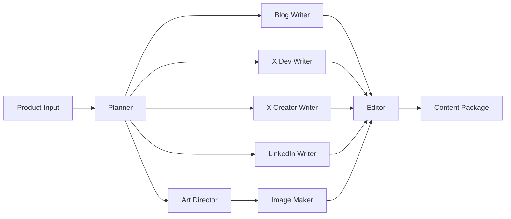

# Content Factory v2 (OpenAI Agent SDK)

Transform a single product description into a complete content package with blog, social posts, and images using specialized AI agents powered by OpenAI SDK and ChromaDB vector memory.

## ✨ What You Get

From one product input, receive:
- 📝 **Technical blog** (1500+ words, Markdown)
- 🐦 **X/Twitter posts** (developer & creator variants)
- 💼 **LinkedIn posts** (enterprise-focused)
- 🎨 **On-brand images** (hero images for each platform)
- 🧠 **Smart memory** (learns from past content via ChromaDB)

## 🚀 Quick Start

```bash
# Setup environment
python -m venv .venv && source .venv/bin/activate
pip install -r requirements.txt

# Configure
export OPENAI_API_KEY=your_key_here

# Initialize vector store (optional but recommended)
python migrations/init_chromadb.py

# Run
uvicorn app:app --reload --port 8000
```

Visit `http://localhost:8000/docs` for interactive API documentation.

## 🤖 Agents

| Agent | Purpose |
|-------|---------|
| **Planner** | Creates content strategy and brief |
| **Blog Writer** | Generates technical blog with code examples |
| **X Dev Writer** | Developer-focused tweets |
| **X Creator Writer** | Creator-friendly hooks (new in v2) |
| **LinkedIn Writer** | Professional posts with enterprise angle |
| **Art Director** | Designs visual concepts (new in v2) |
| **Image Maker** | Generates images via your T2I API |
| **Editor** | Quality control and consistency |

### Agent Flow



## 🔑 Key Features

- **🧠 Vector Memory** - ChromaDB stores and learns from all content ([details](./CHROMADB_USAGE.md))
- **🎯 RAG-Enhanced** - Agents retrieve context for consistency
- **📊 Performance Tracking** - Learn from successful content patterns
- **🛡️ Guardrails** - Built-in safety and quality checks
- **🔧 Extensible** - Easy to add new agents and content types

## 📡 Main API

```bash
POST /content-package
{
  "product_input": "Your product description...",
  "canonical_url": "https://your-site.com/product"
}
```

Returns complete content package with blog, social posts, and image prompts.

## 🛠️ Tech Stack

**Core**: Python 3.11+ • FastAPI • OpenAI Agent SDK • ChromaDB  
**Optional**: Bitly API • Custom T2I endpoint • CMS webhooks

## 📚 Documentation

- [**ChromaDB Usage**](./CHROMADB_USAGE.md) - Vector store setup and features
- [**Agent Details**](./docs/AGENTS.md) - In-depth agent capabilities
- [**API Reference**](http://localhost:8000/docs) - Interactive API docs (when running)
- [**Examples**](./examples/) - Quickstart code samples

## 🔧 Configuration

Key files:
- `style_guide.yaml` - Brand voice and visual guidelines
- `content_contracts.py` - Output schemas
- `.env` - API keys and endpoints

## 📝 License

MIT